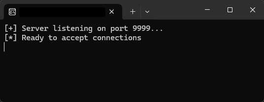

# vulnserver

A basic vulnerable server for buffer overflow studies.

---

This is a simple server that listens on port 9999 for TCP connections. It's useful for the first steps in learning about buffer overflow and reverse engineering.

The server uses a DLL with a gadget that helps point to the shellcode address. The gadget is written directly in assembly for better control in this case study.

The vulnserver.c source code has plenty of comments to help with understanding how to make a simple server and where the vulnerability occurs.
